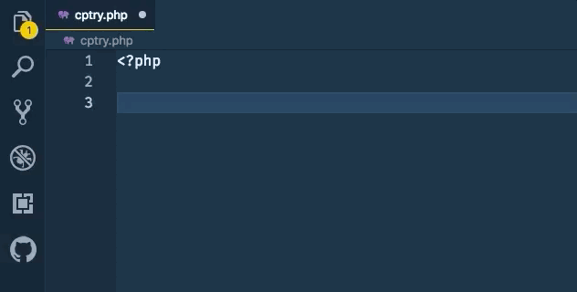

# ClassicPress Snippets

ClassicPress Snippets enables Visual Studio Code users use snippets and autocompletions from ClassicPress and WordPress in their plugin and theme Development.

Initial Release [1st August 2019] of a ClassicPress Development snippets extension.
***PS:** This is a personal project and not an official extension from ClassicPress.net or WordPress.org.*

[See changelog via ](https://marketplace.visualstudio.com/items/laurencebahiirwa.classicpress-snippets/changelog)

### Installation instructions

- Install via Extension Marketplace inside VS Code.
- Search for `Classicpress Snippets`
- Install and use.

### How to use

Type `start_plugin` or `cp_dev` and hit tab to see autocompletions in work.

-   License: MIT
-   Version: 0.5.1
-   Extension URI: https://github.com/bahiirwa/classicpress-snippets

## Known Issues
Please find all known or make any new [issues here](https://github.com/bahiirwa/classicpress-snippets/issues)

### Features

Autocomplete for:

| Software           | Functions | Constants/Classes |
| ------------------ | :-------: | ----------------: |
| ClassicPress 1.1.0 |    14+    |                0+ |
| WordPress 4.6.1    |   2884+   |              191+ |
| WP CLI             |   4+      |                1+ |

and counting.
